<h1 align="center">基于SpringBoot框架的共享单车管理系统【带论文】</h1>

- <b>完整代码获取地址：从戎源码网 ([https://armycodes.com/](https://armycodes.com/))</b>
- <b>技术探讨、资料分享，请加QQ群：692619798</b>
- <b>作者微信：19941326836  QQ：3645296857</b>
- <b>承接计算机毕业设计、Java毕业设计、Python毕业设计、深度学习、机器学习</b>
- <b>选题+开题报告+任务书+程序定制+安装调试+论文+答辩ppt 一条龙服务</b>
- <b>所有选题地址 ([https://github.com/Descartes007/allProject](https://github.com/Descartes007/allProject)) </b>

## 一、项目介绍

基于SpringBoot框架的共享单车管理系统，系统角色为监管部门、运营人员、调度人员、普通用户，主要功能如下
### 监管部门：
- 基本操作：登录、获取验证码
- 菜单导航：获取左侧菜单（基于用户权限）
- 车辆管理：获取车辆列表、分页筛选（按编号模糊）、新增车辆、修改车辆、删除车辆
- 区域管理：新增区域、查看区域列表
- 调度管理：获取调度列表、添加调度、修改调度、删除调度
- 故障管理：获取故障列表（含报修用户与车辆信息）
- 申诉管理：获取申诉列表（筛选内容、状态、分页）、审批申诉
- 数据统计：车辆区域分布饼图、车辆数量区域柱状图
### 运营人员：
- 基本操作：登录、获取验证码
- 菜单导航：获取左侧菜单（基于用户权限）
- 车辆管理：获取车辆列表、分页筛选（按编号模糊）、新增车辆、修改车辆、删除车辆
- 区域管理：新增区域、查看区域列表
- 调度管理：获取调度列表、添加调度、修改调度、删除调度
- 故障管理：获取故障列表（含报修用户与车辆信息）
- 申诉管理：获取申诉列表（筛选内容、状态、分页）、审批申诉
- 数据统计：车辆区域分布饼图、车辆数量区域柱状图
### 调度人员：
- 基本操作：登录、获取验证码
- 菜单导航：获取左侧菜单（基于用户权限）
- 车辆管理：获取车辆列表、分页筛选（按编号模糊）
- 区域管理：查看区域列表
- 调度管理：获取调度列表、添加调度、修改调度、删除调度
- 故障管理：获取故障列表（含报修用户与车辆信息）
- 申诉管理：获取申诉列表（筛选内容、状态、分页）
- 数据统计：车辆区域分布饼图、车辆数量区域柱状图
### 普通用户：
- 基本操作：登录、获取验证码
- 菜单导航：获取左侧菜单（基于用户权限）
- 车辆浏览：获取单车列表
- 区域查看：查看区域列表
- 违规记录：获取本人违规记录列表（筛选原因、分页）
- 申诉管理：获取本人申诉列表（筛选内容、状态、分页）、提交申诉
- 故障报修：提交故障报修
- 行程记录：获取本人骑行记录列表
- 个人统计：查看本人骑行时长折线图

## 二、项目技术

- 编程语言：Java
- 项目架构：B/S 架构
- 前端技术：Vue 2、ElementUI、jQuery、ECharts
- 后端技术：Spring Boot 2.7.x、MyBatis-Plus、Lombok、Hutool、Easy Captcha、MySQL

## 三、运行环境

- JDK版本：1.8及以上都可以
- 操作系统：Windows7/10、MacOS
- 开发工具：IDEA、Ecplise、MyEclipse都可以

## 四、数据库配置文件

- npm版本：6.14.13及以上都可以
- Redis版本：3.2.100及以上都可以
- 文件名：application.yml
- 编码类型：utf8

## 论文截图

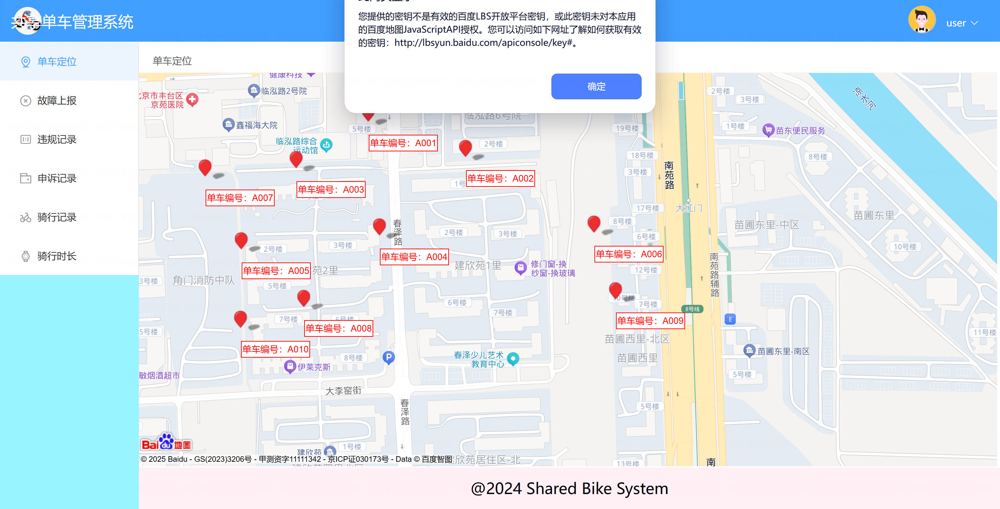

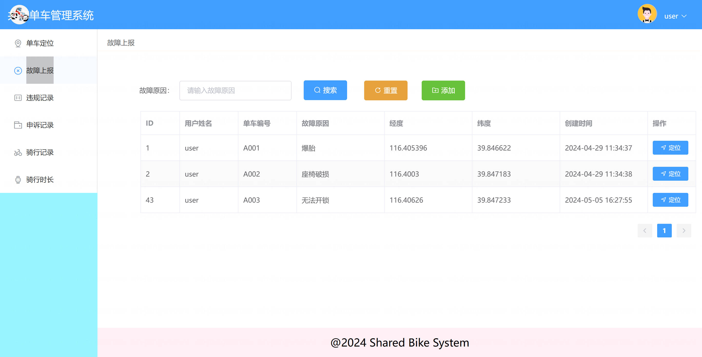

## 系统截图

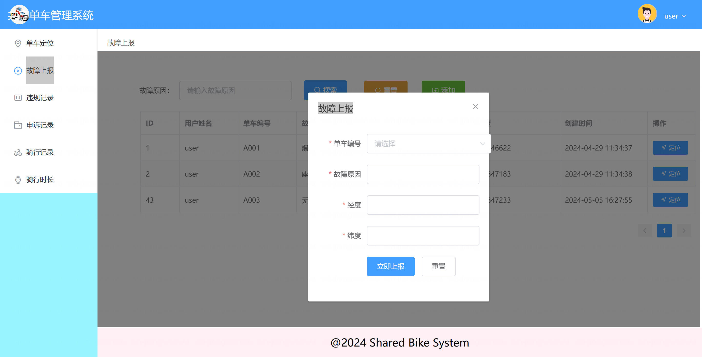

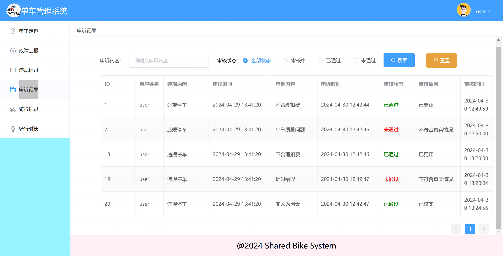

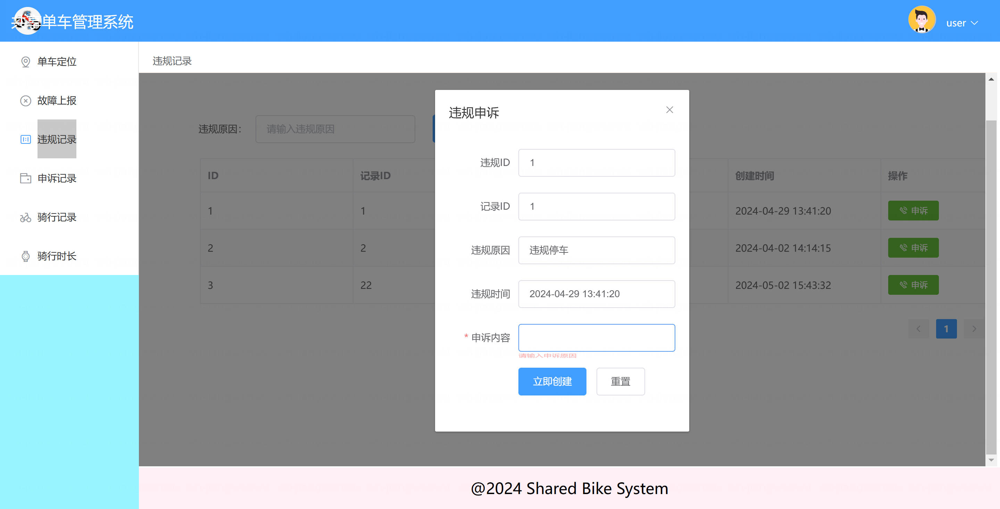

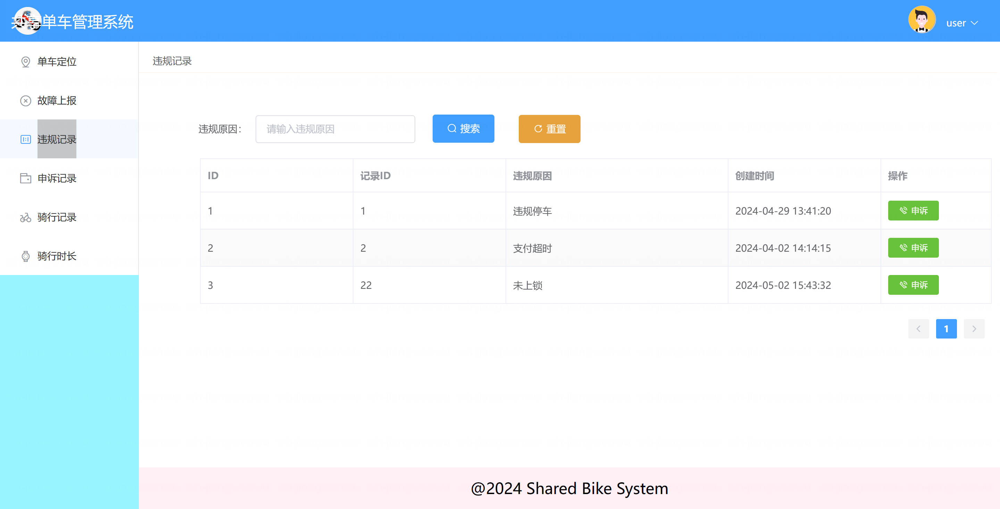

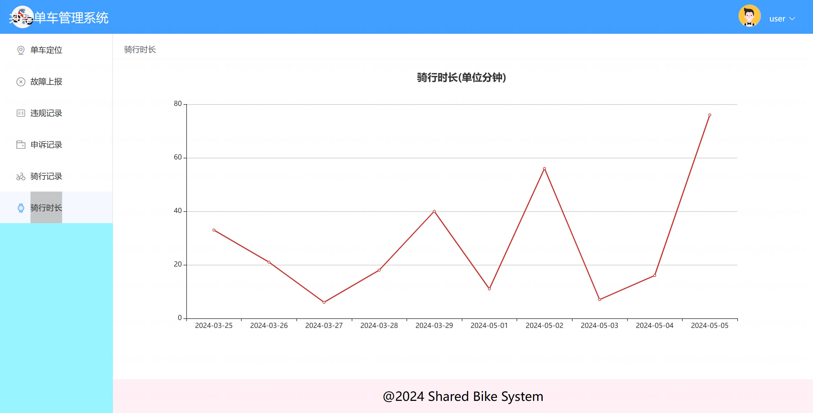

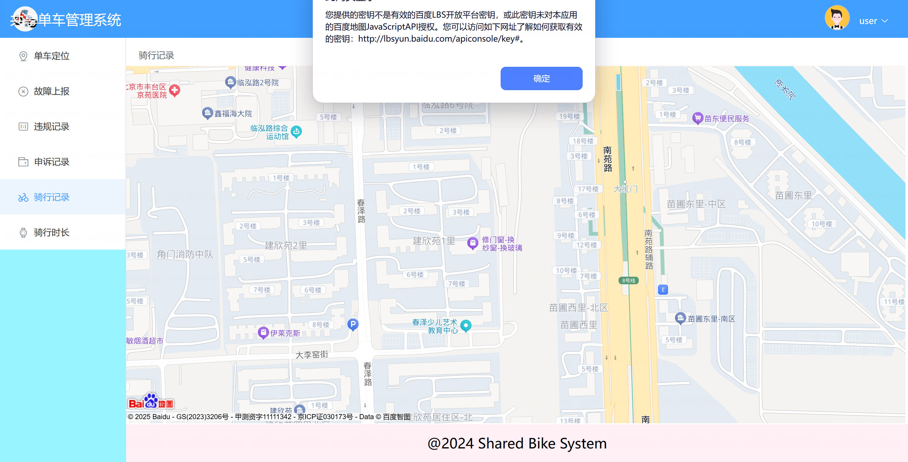

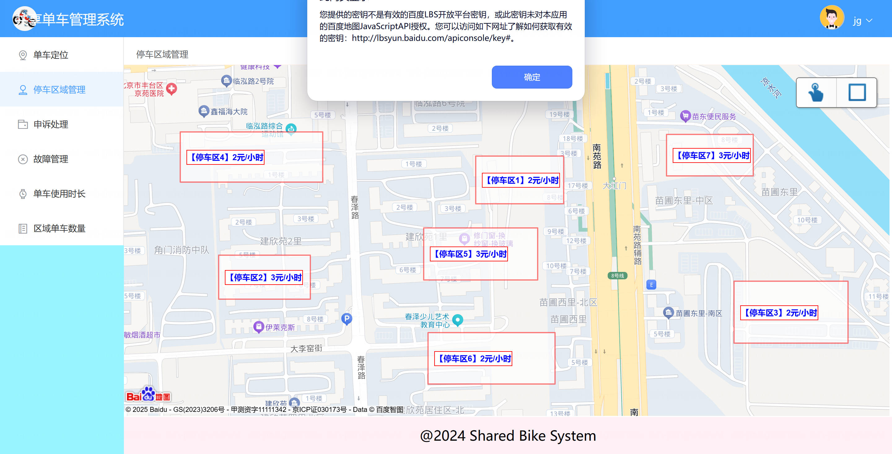

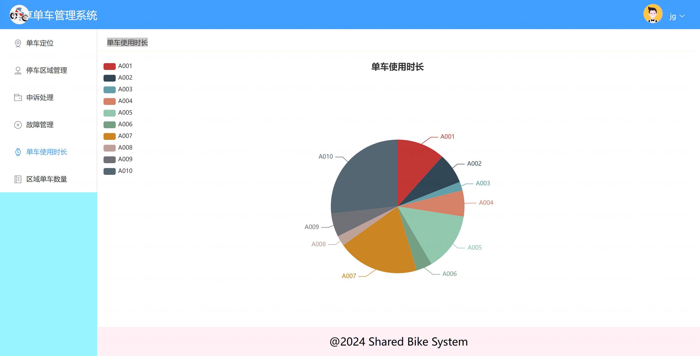

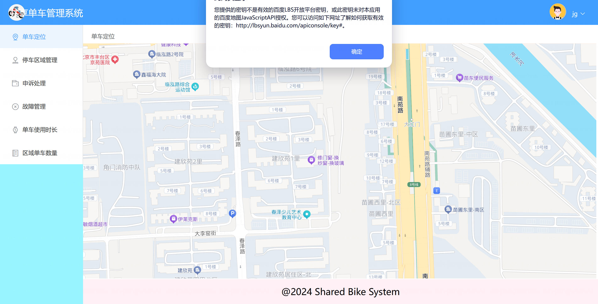

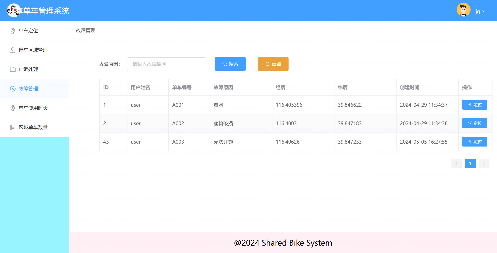
